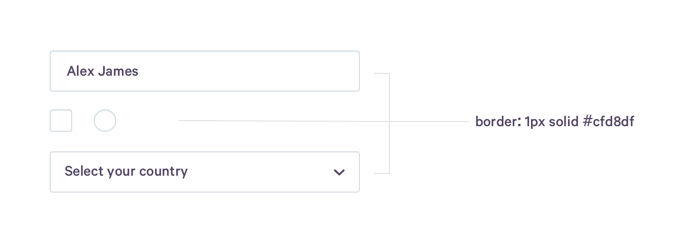

“Buttons, inputs, typography“. The foundations of any design system right? As engineers and designers, it often helps us to break up a user interface in to a collection of smaller parts. Whether these manifest as symbols in our design tools, or components in our codebases, these smaller chunks are often used as the grounds for a UI system.

However if we dig deeper, we can still find shared patterns among these components, whether it be font sizing, or spacing, or colour.

As an example, we can breakdown a web dropdown (`<select>`) in to some primitive values:

- the font sizing of the placeholder (`14px`)
- the background color of the box (`#fff`)
- the border style of the box (`1px solid #cfd8df`)

These values are often the same across multiple components. For example, the border color of a dropdown on hover, will likely be the same as the border color of a text input or checkbox on hover.



## Encouraging experimentation

Thinking about our components as compositions of these values, helps us to not only begin to consider how we can remove duplication (to keep our code DRYer), but also encourages us to create more open systems.

One of the hardest part of building a good UI system, is finding the balance between providing a baseline for others to work from and being too restrictive.

Defining components as the lowest elements of a system provides little room for experimentation without either creating variants of an existing component; composing existing components to make a new larger component; or creating an entirely new component. It's here that divergence often happens.

These values (often referred to as 'design tokens'), provide a nice route to opt out of the provided components, but still remain within the bounds of the system. For example, an engineer may want to build a variant of an input, that although visually looks similar to a normal input, may have a wildly different technical implementation.

Consider the following two components. Although both the wrapping containers are visually similar, they must have two seperate implementations to allow for the second component to contain non-text content.


The implementation of the first component might be as simple as:

```html
<input type="text" value="Alex James" class="text-input" />
```

Where as the second component might look like this:

```html
<div class="visual-input">
  <span class="tag">Design</span>
  <span class="tag">Development</span>
  <span class="tag">Ruby</span>
</div>
```

Abstracting the style values out from the individual implementations, allows us to have a single source of truth and keep our code dryer.

## Sharing values across platforms

To further complicate the above example, consider if the second component was not written in HTML, but rather was a React component written using emotion/styled-components which might look something like this:

```js
const VisualInput = styled.div`
  border: 1px solid #cfd8df;

  &:hover {
    border: 1px solid #3255f1;
  }
`;

<VisualInput>
  <Tag>Design</Tag>
  <Tag>Development</Tag>
  <Tag>Ruby</Tag>
</VisualInput>
```

Having the styles hard-coded within the invidual implementations provides opportunity for divergence. Using design tokens, we can abstract the style values out above the implementations, and then pass those values back down to the implementations via variables.


Our example above refactored to use design tokens, could look something like this:

**Master design tokens file**
```json
{
  "input": {
    "defaultBorderColor": "1px solid #cfd8df",
    "hoverBorderColor": "1px solid #3255F1"
  }
}
```

**Auto-generated variables for use in CSS**

```css
:root {
  --inputDefaultBorderColor: 1px solid #cfd8df;
  --inputhoverBorderColor: 1px solid #3255f1;
}
```

_...example usage..._

```css
input {
  border: var(--inputDefaultBordercolor);
}

input:hover {
  border: var(--inputHoverBordercolor);
}
```

**Auto-generated variables for use in a css-in-js theme**


```js
const theme = {
  input: {
    defaultBorderColor: '1px solid #cfd8df',
    hoverBorderColor: '1px solid #3255F1',
  },
};
```

_...example usage..._

```js
const VisualInput = styled.div`
  border: ${props => props.theme.input.defaultBorderColor};

  &:hover {
    ${props => props.theme.input.hoverBorderColor};
  }
`;

<ThemeProvider theme={theme}>
  <VisualInput />
</ThemeProvider>;
```

Tools such as [Theo](https://github.com/salesforce-ux/theo) will help you to convert your design tokens in to the required formats.

---


## Further reading

1. [Dan Eden on Designing Product UI Systems](https://daneden.me/2017/03/29/designing-systems/)
2. [styled-system - A React library for building design systems using a theme/tokens approach](https://github.com/jxnblk/styled-system)
